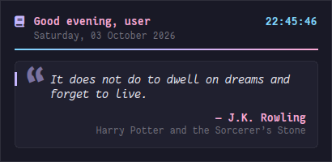
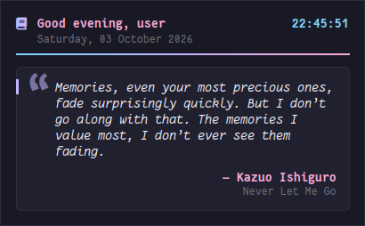
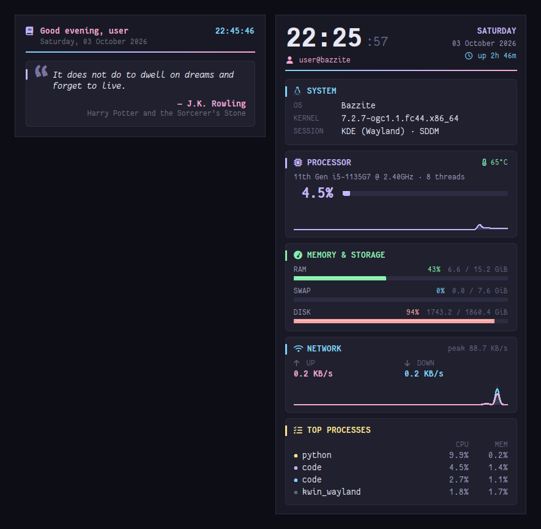

# pyQuotes

A lightweight desktop widget for Linux that shows a greeting, the date and time, and a rotating literary quote. It's written in Python with Tkinter, and it stays quietly on your desktop *below* all other windows.

<p align="center">
  
</p>


-191926?style=flat-square&logo=linux&logoColor=white)
-86efac?style=flat-square)


## Features

- **Rotating quotes:** 150+ literary quotes in [`quotes_data.py`](quotes_data.py). A new one appears every minute by default. Quotes are shuffled like a deck of cards: every quote is shown once before any repeats, and the deck's position is kept across restarts.
- **Greeting and clock:** "Good morning / afternoon / evening, *name*", with a live clock and the date.
- **Lives on the desktop:** stays below other windows, has no title bar or border, and doesn't appear in the taskbar, pager or Alt+Tab.
- **Makes room for bars:** keeps below X11 bars such as [kBar](https://github.com/y-v-j/kBar) or another polybar, and moves back up when the bar stops. (KWin on Wayland doesn't reserve their space itself.)
- **Polished look:** "Midnight Ink" theme (`#191926`), a rounded quote card, a gradient divider, and antialiased Fantasque Sans Mono Nerd Font text.
- **Live configuration:** edits to `~/.config/pyconky/config.json` apply within two seconds, with no restart. That includes the quote interval.
- **Right-click menu:** new quote, move the widget, toggle margins, edit or reload the config, quit.
- **No third-party dependencies:** the Python standard library and Tkinter only. Window handling talks to `libX11` directly through `ctypes`, so `xprop` and `xdotool` aren't needed.
- **Crash-proof timers:** errors from a bad config value or a malformed quote are logged instead of freezing the clock or the quote rotation.

<p align="center">
  
  <br><em>The widget grows to fit longer quotes.</em>
</p>

### Works alongside pySysMon

By default pyQuotes sits at the top-right of the screen, just left of the [pySysMon](https://github.com/y-v-j/pySysMon) system monitor, so the two never overlap:

<p align="center">
  
</p>

## Requirements

| Requirement | Notes |
|---|---|
| Linux with an X11 or XWayland session | Tested on Bazzite (KDE Plasma 6, Wayland via XWayland) |
| Python 3.10+ with `tkinter` | Tk **must be built with Xft**. Without Xft, text renders in blocky bitmap fonts (see [Troubleshooting](#troubleshooting)) |
| [Fantasque Sans Mono Nerd Font](https://www.nerdfonts.com/font-downloads) | Installed automatically by `install.sh`. Any installed font works as a fallback |
| `conda` / Miniforge *(recommended)* | The installer uses it to get a Python with an Xft-enabled Tk |

> **Why conda?** Bazzite's system Python ships without `tkinter`, and the Tk builds bundled with Anaconda and `uv`'s Python lack Xft. conda-forge publishes an Xft-enabled Tk build (`tk=*=xft_*`), which gives smooth, antialiased fonts without modifying the immutable base system.

## Installation

### Quick install (recommended)

```bash
git clone https://github.com/y-v-j/pyQuotes.git
cd pyQuotes
./install.sh
```

Everything is installed in your home directory, so no root access is needed. The installer:

1. Installs **Fantasque Sans Mono Nerd Font** to `~/.local/share/fonts/` (skipped if it's already installed).
2. Sets up Python:
   - **conda found:** creates (or reuses) a conda env named **`conky-env`** with Python 3.12 and an Xft-enabled Tk. pySysMon uses the same env.
   - **No conda:** creates a venv from a system Python that has `tkinter`. It warns you if that Tk lacks Xft.
3. Copies `pyconky.py` and `quotes_data.py` to `~/.local/share/pyquotes/` and writes a `launch.sh` launcher. The launcher uses a lock file so only one widget runs at a time.
4. Registers the widget to start at login (see [Start at login](#start-at-login)) and launches it.

#### Installer options

```text
./install.sh [--startup autostart|systemd|none] [--python PATH] [--no-start] [--uninstall]

  --startup MODE   How to launch at login: autostart (default), systemd, none
  --python PATH    Use a specific Python interpreter (must have tkinter)
  --no-start       Don't launch the widget after installing
  --uninstall      Remove the app and its startup entries
```

Set `PYQUOTES_CONDA_ENV=<name>` to use a different conda env name.

### Manual installation

```bash
# 1. Font
mkdir -p ~/.local/share/fonts/FantasqueSansMNerdFont
curl -fsSL https://github.com/ryanoasis/nerd-fonts/releases/latest/download/FantasqueSansMono.tar.xz \
  | tar -xJ -C ~/.local/share/fonts/FantasqueSansMNerdFont
fc-cache -f

# 2. Python env with an Xft-enabled Tk
conda create -n conky-env -c conda-forge --override-channels "python=3.12" "tk=8.6.*=xft_*"

# 3. App (both files must be in the same folder)
mkdir -p ~/.local/share/pyquotes
cp pyconky.py quotes_data.py ~/.local/share/pyquotes/

# 4. Run
"$(conda info --base)/envs/conky-env/bin/python" ~/.local/share/pyquotes/pyconky.py
```

## Usage

| Action | Command |
|---|---|
| Start the widget | `~/.local/share/pyquotes/launch.sh` |
| Stop the widget | `pkill -f ~/.local/share/pyquotes/pyconky.py`, or right-click → **Quit** |
| Restart the systemd service | `systemctl --user restart pyquotes` |

Running `launch.sh` again while the widget is up does nothing, because the single-instance lock blocks it.

### Widget controls

Right-click the widget to open its menu:

| Menu item | What it does |
|---|---|
| **New quote** | Skips to the next quote in the deck now. The next automatic change comes a full interval later |
| **Toggle lock (drag to move)** | Unlocks the widget so you can drag it with the left mouse button. Toggle again to lock it; the new position is saved |
| **Toggle margins** | Switches between roomy and compact padding |
| **Edit config file…** | Opens the config in `$EDITOR`, or your default text editor |
| **Reload config** | Re-reads the config immediately (it also reloads on its own when the file changes) |
| **Quit** | Closes the widget |

### Adding your own quotes

Quotes live in `quotes_data.py` as a Python list of `(quote, author, book)` tuples. Use `""` when there's no book:

```python
QUOTES = [
    ("It does not do to dwell on dreams and forget to live.", "J.K. Rowling", "Harry Potter and the Sorcerer’s Stone"),
    ("I have always imagined that Paradise will be a kind of library.", "Jorge Luis Borges", ""),
    # ...add yours here; mind the commas and quote marks
]
```

Keep three things in mind:

- **Edit the installed copy, or re-install.** The running widget reads `~/.local/share/pyquotes/quotes_data.py`. Either edit that file, or edit the one in this repository and run `./install.sh` again.
- **Restart the widget afterwards.** Quotes are loaded once at startup. Unlike the config, they aren't hot-reloaded. The installer restarts the widget for you.
- **Mind the length limit.** Quotes longer than `quote_max_chars` (300 characters by default) are skipped. Raise that value in the config to include them.
- **New quotes join the next round.** The current shuffled round finishes first; the next round includes your additions. To start a fresh round straight away, delete `~/.config/pyconky/quote_deck.json` before restarting.

## Configuration

Settings are stored at `~/.config/pyconky/config.json`, which is created on first run. Saved changes apply within two seconds, with no restart needed.

```json
{
    "config_version": 2,
    "username_override": null,
    "font_family": null,
    "font_size": 15,
    "font_color": "#e8e8f2",
    "accent_color": "#c4b5fd",
    "secondary_color": "#f9a8d4",
    "clock_color": "#7dd3fc",
    "bg_color": "#191926",
    "card_color": "#20202f",
    "bg_opacity": 0.96,
    "show_margins": true,
    "margin_size": 18,
    "corner": "top-right",
    "offset_x": 450,
    "offset_y": 24,
    "width": 410,
    "quote_refresh_minutes": 1,
    "quote_max_chars": 300,
    "locked": true,
    "date_format": "%A, %d %B %Y",
    "time_format": "%H:%M:%S"
}
```

| Option | Description |
|---|---|
| `username_override` | Name shown in the greeting. `null` uses your system username |
| `font_family` | Any installed font. `null` picks automatically, trying Fantasque Sans Mono Nerd Font first. A Nerd Font also enables the header icon |
| `font_size` | Base text size in pixels |
| `font_color` | Quote text colour |
| `accent_color` | Quote mark, card notch and divider colour (lavender) |
| `secondary_color` | Greeting and author colour (rose) |
| `clock_color` | Clock colour (sky blue) |
| `bg_color` / `card_color` | Window background and quote-card fill |
| `bg_opacity` | Window opacity, from `0.0` (invisible) to `1.0` (opaque) |
| `show_margins` / `margin_size` | Outer padding on or off, and its size in pixels |
| `corner` | `top-left`, `top-right`, `bottom-left` or `bottom-right` |
| `offset_x` / `offset_y` | Distance from that corner, measured from the usable screen area (panels and X11 bars such as kBar excluded). The default `offset_x: 450` leaves room for pySysMon |
| `width` | Widget width in pixels. The height fits the quote automatically |
| `quote_refresh_minutes` | Minutes between quotes. Decimals are allowed; the minimum is 5 seconds |
| `quote_max_chars` | Quotes longer than this are skipped (all bundled quotes fit within the default 300) |
| `locked` | `false` lets you drag the widget with the left mouse button |
| `date_format` / `time_format` | [`strftime`](https://docs.python.org/3/library/time.html#time.strftime) formats, e.g. `"%d-%m-%y"` or `"%I:%M %p"` |

Configs from older versions are upgraded automatically on first start. The old file is saved as `config.json.v1.bak`, and only the appearance and position settings are reset.

## Start at login

The installer sets this up for you. Choose one method; the installer switches cleanly between them.

### Option A: XDG autostart (default; KDE Plasma, GNOME and others)

```bash
./install.sh --startup autostart
```

This installs [`pyquotes.desktop`](pyquotes.desktop) to `~/.config/autostart/`. To set it up by hand:

```bash
mkdir -p ~/.config/autostart
cp pyquotes.desktop ~/.config/autostart/
```

On KDE Plasma you can also manage it in **System Settings → Autostart**.

### Option B: systemd user service

```bash
./install.sh --startup systemd
```

This installs [`pyquotes.service`](pyquotes.service), which starts with your graphical session and restarts the widget if it crashes. To set it up by hand:

```bash
mkdir -p ~/.config/systemd/user
cp pyquotes.service ~/.config/systemd/user/
systemctl --user daemon-reload
systemctl --user enable --now pyquotes.service
```

### Disable startup

```bash
./install.sh --startup none
```

> The widget starts once you log in, because it needs your desktop session. If you want it on screen right after boot, enable automatic login for your display manager.

## Uninstall

```bash
./install.sh --uninstall
```

This removes the app, launcher and startup entries. Your config (`~/.config/pyconky/`), the font and the `conky-env` conda env are kept. The uninstaller prints the commands to remove the font and env.

## Troubleshooting

**Text looks blocky or pixelated.**
Your Python's Tk was built without Xft, so it can only use X11 bitmap fonts. To check:

```bash
python3 -c "import _tkinter; print(_tkinter.__file__)" | xargs ldd | grep -i xft
```

No output means no Xft. Re-run `./install.sh` with conda/Miniforge installed, or pass `--python` with an interpreter whose Tk links `libXft`.

**The widget doesn't start after I edited `quotes_data.py`.**
A typo, such as a missing comma or an unclosed quote mark, makes the file invalid Python. Run `python3 ~/.local/share/pyquotes/quotes_data.py`; it prints the line with the error.

**The widget doesn't start at login.**
Run `systemctl --user status app-pyquotes@autostart.service`. If the log shows `$HOME/.local/share/pyquotes/launch.sh: No such file or directory`, your autostart entry comes from an older release whose `Exec=` line used `$HOME`. KDE Plasma and GNOME run autostart entries through systemd, which escapes the `$`, so the path is never expanded. Re-run `./install.sh`, or copy the current `pyquotes.desktop` to `~/.config/autostart/`.

**The widget covers other windows.**
The widget asks the window manager to keep it below other windows (`_NET_WM_STATE_BELOW`). This works on KWin and most EWMH-compliant window managers. Native Wayland compositors without XWayland aren't supported.

**The widget disappears when I press "Show Desktop".**
KDE's Show Desktop (Meta+D) also hides windows kept below others. Press it again to bring the widget back.

## Project layout

```text
pyconky.py              The widget
quotes_data.py          The quote collection
config.json             Sample config (matches the built-in defaults)
install.sh              User-space installer / uninstaller
pyquotes.desktop        XDG autostart entry
pyquotes.service        systemd user service
assets/                 README screenshots
src/, index.html, ...   Legacy web preview prototype
```

## Credits

- [Fantasque Sans Mono](https://github.com/belluzj/fantasque-sans) by Jany Belluz, and its [Nerd Fonts](https://www.nerdfonts.com/) build. Both are under the SIL Open Font License.
- Quotes are from the books and authors credited alongside each one.

## License

[MIT](LICENSE) © 2026 Yogesh
